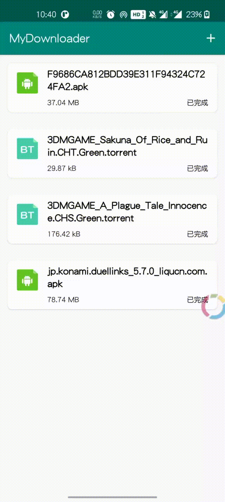

# ZDownloader
Android多线程下载库，可以自定义下载任务，可扩展性强。


[The demo](https://github.com/Z-P-J/ZDownloader/tree/master/app)

 <div>
     
 </div>

## Install

#### Latest Version：1.0.0
```groovy
implementation 'com.github.Z-P-J:ZDownloader:latest_version'
```

## How To Use？
### 一. 简单使用
#### 1. 初始化
```java
public class MyApplication extends Application {

    @Override
    public void onCreate() {
        super.onCreate();
        ZDownloader.init(this); //初始化
    }

}            
```

#### 2. 创建下载并监听进度
```java
ZDownloader.download("your download url")
    .addListener(new DownloadMission.MissionListener() {
        @Override
        public void onInit() {}
        
        @Override
        public void onStart() {}
        
        @Override
        public void onPause() {}
        
        @Override
        public void onWaiting() {}
        
        @Override
        public void onRetry() {}
        
        @Override
        public void onProgress(DownloadMission.ProgressUpdater update) {}
        
        @Override
        public void onFinish() {}
        
        @Override
        public void onError(Error e) {}
        
        @Override
        public void onDelete() {}
        
        @Override
        public void onClear() {}
    })
    .start(); // 开始下载任务

```

#### 3. 退出应用时
```java
@Override
protected void onDestroy() {
    super.onDestroy();
    ZDownloader.onDestroy();
}
```

#### 4. 其它操作
```java
//暂停下载
mission.pause();

//恢复下载
mission.start();

//删除下载任务和下载文件
mission.delete();

//删除下载任务(不包含下载文件)
mission.clear();

//暂停所有下载任务
ZDownloader.pauseAll();

//恢复所有下载任务
ZDownloader.resumeAll();

//删除所有下载任务和下载文件
ZDownloader.deleteAll();

//删除所有下载任务(不包含下载文件)
ZDownloader.clearAll();

//打开下载完成的文件
mission.openFile(); // 使用初始化时的Context
mission.openFile(context);

//重命名文件
mission.renameTo(newName);
```

### 二. 高级使用
#### 1. 在Application中初始化时进行全局设置
```java
public class MyApplication extends Application {

    @Override
    public void onCreate() {
        super.onCreate();
        //全局设置
        ZDownloader.config(this)
            .setDownloadPath("") //设置默认下载路径
            .setProducerThreadCount(3) // 生产者线程数
            .setConsumerThreadCount(9) // 消费者线程数
            .setConcurrentMissionCount(3) // 同时下载任务数
            .setBlockSize(1024 * 1024) //设置下载块大小，默认为1024 * 1024
            .setBufferSize(1024) //设置缓存大小
            //.setThreadCount(5) //已过时。设置线程大小，默认为3
            .setRetryCount(10) //设置出错重试次数，默认为5
            .setRetryDelay(10000) //设置重试延迟，单位为ms
            .setUserAgent("") //设置UA，默认为系统自带UA
            .setCookie("") //设置全局下载任务cookie，默认为空
            .setConnectOutTime(10000) //设置连接超时，单位ms
            .setReadOutTime(10000) //设置读取请求内容超时，单位ms
            .setEnableNotification(true) //是否显示通知栏下载进度通知，默认为true
            .setNotificationInterceptor(new DownloadNotificationInterceptor()) // 设置通知拦截器
            .setHeaders(new HashMap<>()) //设置请求头
            .addHeader(key, value)
            .setProxy(Proxy.NO_PROXY) //设置代理
            //.setProxy("127.0.0.1", 80) //设置代理
            .setAllowAllSSL() // 是否取消https验证
            .setConflictPolicy(new DefaultConflictPolicy()) // 设置下载任务冲突策略，处理相同的冲突任务，默认不处理冲突（DefaultConflictPolicy）
            .init();
    }

}            
```

#### 2. 创建下载任务时单独设置下载配置
```java
//为每个下载任务进行设置，优先使用单独设置的参数
ZDownloader.download(url)
    .setDownloadPath("") //设置默认下载路径
    .setProducerThreadCount(3) // 生产者线程数
    .setConsumerThreadCount(9) // 消费者线程数
    .setBlockSize(1024 * 1024) //设置下载块大小，默认为1024 * 1024
    .setBufferSize(1024) //设置缓存大小
    //.setThreadCount(5) //已过时。设置线程大小，默认为3
    .setRetryCount(10) //设置出错重试次数，默认为5
    .setRetryDelay(10000) //设置重试延迟，单位为ms
    .setUserAgent("") //设置UA，默认为系统自带UA
    .setCookie("") //设置全局下载任务cookie，默认为空
    .setConnectOutTime(10000) //设置连接超时，单位ms
    .setReadOutTime(10000) //设置读取请求内容超时，单位ms
    .setEnableNotification(true) //是否显示通知栏下载进度通知，默认为true
    .setNotificationInterceptor(new DownloadNotificationInterceptor()) // 设置通知拦截器
    .setHeaders(new HashMap<>()) //设置请求头
    .setProxy(Proxy.NO_PROXY) //设置代理
    //.setProxy("127.0.0.1", 80) //设置代理
    .setAllowAllSSL() // 是否取消https验证
    .addListener(listener) // 下载进度回调
    .setConflictPolicy(new DefaultConflictPolicy() { // 设置下载任务冲突策略，以下展示了当冲突时弹出对话框确认是否继续下载
        @Override
        public void onConflict(BaseMission<?> mission, Callback callback) {
            ZDialog.alert()
                .setTitle("任务已存在")
                .setContent("下载任务已存在，是否继续下载？")
                .setPositiveButton(new IDialog.OnButtonClickListener<ZDialog.AlertDialogImpl>() {
                    @Override
                    public void onClick(ZDialog.AlertDialogImpl fragment, int which) {
                        callback.onResult(true);
                    }
                })
                 .setNegativeButton(new IDialog.OnButtonClickListener<ZDialog.AlertDialogImpl>() {
                    @Override
                    public void onClick(ZDialog.AlertDialogImpl fragment, int which) {
                        callback.onResult(false);
                    }
                 })
                 .show(context);
        }
    })
    .start();
```

#### 3. 通知拦截
```java
/**
 * 实现INotificationInterceptor接口，在onProgress、onFinished、onError方法中更新通知
 */
public class DownloadNotificationInterceptor implements INotificationInterceptor {

    @Override
    public void onProgress(Context context, BaseMission<?> mission, float progress, boolean isPause) {
        Intent intent = new Intent(context, MainActivity.class);
        PendingIntent pendingIntent = PendingIntent.getActivity(context, 0, intent, PendingIntent.FLAG_UPDATE_CURRENT);
        ZNotify.with(context)
                .buildProgressNotify()
                .setProgressAndFormat(progress, false, "")
                .setContentTitle((isPause ? "已暂停：" : "") + mission.getTaskName())
                .setContentIntent(pendingIntent)
                .setId(mission.getNotifyId())
                .show();
    }

    @Override
    public void onFinished(Context context, BaseMission<?> mission) {
        Intent intent = new Intent(context, MainActivity.class);
        PendingIntent pendingIntent = PendingIntent.getActivity(context, 0, intent, PendingIntent.FLAG_UPDATE_CURRENT);
        ZNotify.with(context)
                .buildNotify()
                .setContentTitle(mission.getTaskName())
                .setContentText("下载已完成")
                .setContentIntent(pendingIntent)
                .setId(mission.getNotifyId())
                .show();
    }

    @Override
    public void onError(Context context, BaseMission<?> mission, int errCode) {
        Intent intent = new Intent(context, MainActivity.class);
        PendingIntent pendingIntent = PendingIntent.getActivity(context, 0, intent, PendingIntent.FLAG_UPDATE_CURRENT);
        ZNotify.with(context)
                .buildNotify()
                .setContentTitle("下载出错" + errCode + ":" + mission.getTaskName())
                .setContentIntent(pendingIntent)
                .setId(mission.getNotifyId())
                .show();
    }

    @Override
    public void onCancel(Context context, BaseMission<?> mission) {
        ZNotify.cancel(mission.getNotifyId());
    }

    @Override
    public void onCancelAll(Context context) {
        ZNotify.cancelAll();
    }

}

// 全局设置通知拦截器
ZDownloader.config(this)
            .setNotificationInterceptor(new DownloadNotificationInterceptor())
            .init();

// 或者下载时单独设置通知拦截器
ZDownloader.download(url)
    .setNotificationInterceptor(new DownloadNotificationInterceptor())
    .start();
```

#### 4. 自定义下载任务（TODO）